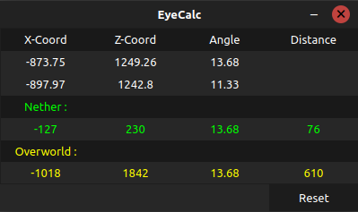

# EyeCalc

A tool for finding stronghold coordinates in Minecraft Speedrunning. It takes coordinate data from your clipboard to find the location of the Stronghold.



## Usage

Download from [releases page](../../releases).

Launch the binary/exe. Throw an ender eye, look at the eye and press F3+C to copy, you can see this measurement in the tool, then move to a new location (preferably one that is perpendicular) and take the second measurement. After that, the tool will show the calculated stronghold coords for both nether and overworld.

Note that a greater distance between the two measurement points will give more accurate coords. But at least move 30 or so blocks in the direction perpendicular to the first angle. Also, getting in and out of a boat will increase accuracy by a lot.

## Features

* Hotkeys to hide/show the tool and reset.
* Stays on top of Minecraft and doesn't steal focus when you use the show hotkey or press F3+C.
* Runs on both Windows and Linux.

## Hotkeys

* For resetting : **`Ctrl + [`**.  
* For showing/hiding the window : **`Ctrl + ]`**.

## Note

Because this is an open-source tool and not digitally signed, Windows Defender SmartScreen may flag it as unrecognized.
If you see "Windows protected your PC", click **More Info** and then **Run Anyway**.

In Linux, just make the binary file executable by using `chmod +x` or check "Allow executing file as program" in the permissions tab in properties.

## Building from Source

```bash
git clone https://github.com/AryanM100/EyeCalc.git
cd EyeCalc

pip install -r requirements.txt
pip install pyinstaller pillow

python eye.py
```

### Build the executable
**Windows :**
```bash
pyinstaller --onefile --noconsole --icon=app.ico --add-data "app.ico;." --name "EyeCalc" eye.py
```
**Linux :**
```bash
pyinstaller --onefile --noconsole --hidden-import pynput.keyboard._xorg --hidden-import pynput.mouse._xorg --add-data "app.ico:." --name "EyeCalc" eye.py
```

**Note :** If you like you can use the `--onedir` flag instead of `--onefile`, this will make the tool open quicker, but then you would have a folder containing the executable and an `_internal` directory instead of a single portable file.